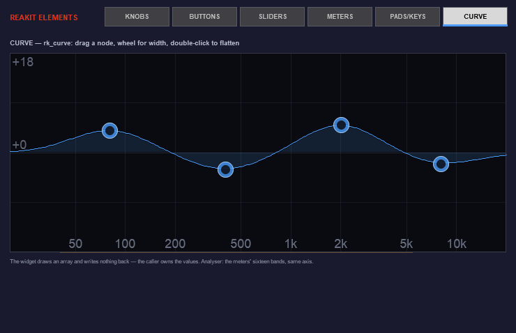

# ReaKit

A free UI / widget library for REAPER JSFX. Every knob, fader, button, meter,
VU needle, EQ curve, drum pad and piano key is drawn procedurally in code, so
your plugin UI is crisp at any size and re-themable with one call.

The ReaKit Elements showcase (installable below) organizes every widget into
six category tabs:


*KNOBS — all 19 styles on one page (a 20th, SSL-G, is style 21). Click one,
scroll to change.*


*BUTTONS — all 10 styles: toggles, pills, LEDs, steppers, list select, rocker,
stomp, tab bar (the showcase's own tab bar is this widget). Below them, the
widgets added in 1.4.0: a text field you can type in, the colour picker, the
ADSR editor, and three chips showing auto-contrast ink pick its own colour
against the background you gave it.*


*SLIDERS — horizontal + arc up top, the vertical fader / console pack
(PT · MPC · 4K) below.*


*METERS — all 12 meters_kbsg styles plus the analog VU (click the VU's coil
cover to pick one of its 20 faces).*


*PADS & KEYS — the drum pad grid and piano keyboard widgets.*



*CURVE — rk_curve at full width: drag a node, wheel it for width, double-click
to flatten. The bands behind it are the meter library's spectrum, placed by
frequency so the two axes agree however either is configured.*

*Everything above is drawn by the library itself.*

**20 knob styles** (SSL, SSL-G, Neve x2, API, Pultec x2, Ableton, Pro Tools,
FabFilter, Serum, Roland, MPC, encoders, jog wheels, ...) · **17 slider/fader
types** (incl. an SSL / Neve / Pro Tools / MPC console pack) · **10 button
styles** · **12 meter styles with the DSP included** (peak/RMS, GR, phase,
goniometer, waveform, spectrum, LUFS) · **analog VU** (rk_vu) that meets the VU
spec — 300 ms to 99%, 1.2% overshoot — with 20 faces, a GR face and a face
picker · **drum pad grid** (any size, MPC pad order) · **piano keyboard**
(horizontal or vertical, any note range).

Since 1.4.0, seven more:

**Response curve** (rk_curve) — an EQ or filter curve with draggable nodes and a
spectrum underlay. It evaluates nothing: you fill an array of dB values and it
draws them, so the same widget serves an EQ, a filter sweep or a compressor
knee. It writes nothing back either — it reports where a dragged node wants to
be and you clamp and automate, which is what lets it leave the plugin it was
written for.
Since 1.6.0 every band wears its own colour, fill and outline, with the summed
curve in white over them, and one switch picks how a band and a node are shown
(fill, lines, both; ring, dot, badge). The showcase's Curve tab has the
selectors under the graph.
**Dropdown** (rk_popup) — a menu that draws itself instead of handing the list
to `gfx_showmenu`, so it looks like your plugin rather than the operating
system. Scrolls when the list outgrows the window, and understands the same
`#` header, `!` tick and separator syntax the native menu does.
**Text field** (rk_textfield) — a single-line editor with a caret, click-to-place,
arrow keys and scrolling. It drains the key queue, because typing outruns the
frame rate and one key per frame silently drops characters. Put `want_all_kb`
on your `options:` line, or REAPER keeps the spacebar for its transport and the
field never sees a space.
**Envelope** (rk_adsr) — drag it by its corners. Each segment owns a fixed slice
of the width, so moving one parameter never shifts the others, and time is
logarithmic in both the drawing and the drag, so 1–50 ms is actually reachable.
**Colour picker** (rk_colorpick) — swatches and a rainbow strip. It holds a hue
and takes saturation and lightness from you, so the swatches match your panel
rather than a palette that suits nobody.
**Tooltips** (rk_tooltip) — keyed by zone, so moving between two controls
restarts the delay instead of reading as one long hover.
**Auto-contrast ink** (rk_ink) — pass the colour behind your text and it picks
near-black or near-white, so a label never vanishes on a themed panel.

Every knob style shares one interaction model: drag, ctrl = fine, mousewheel,
double-click reset, detents, automation-safe writes.

## Install (ReaPack)

Extensions > ReaPack > Import repositories, paste:

```
https://raw.githubusercontent.com/mequaz-sudo/ReaKit/main/index.xml
```

Then install **ReaKit Elements** from the browser — it brings the library incs
with it and doubles as the element showcase, organized into category tabs
(Knobs / Buttons / Sliders / Meters / Pads & Keys — drop it on a track to see
and feel every widget).

## EON Floatter

Also in this repo: **EON Floatter**, a script. Every EON plugin's floating
window opens at the size EON designed for it, and any JSFX float can be
captured at a size of your own. Run it once from the Action List: it switches
on, starts with REAPER from then on, and shows its panel (shape cards to
scale, a live resize handle, Capture / Reset, one dial for all EON sizes,
Apply EON sizes to this project). Run it again to open the panel; closing
the panel never stops it. Needs js_ReaScriptAPI; the panel needs ReaImGui,
both from ReaTeam Extensions. MIT.

## Free FX

Also free here: **ReaKit Free FX**, four classic REAPER effects with EON
Studios interfaces — **Saturation**, **3-Band EQ** and **DDC** (Digital Drum
Compressor) by LOSER, and a **De-Esser** on Liteon's. Install it from the
ReaPack browser. The DSP keeps its authors' original terms; see
`FX/LICENSE.md`.

## Use in your JSFX

The library installs to `Effects/ReaKit/Library/`. From your own plugin:

```
import ReaKit/Library/knobs_kbsg.jsfx-inc
import ReaKit/Library/sliders_kbsg.jsfx-inc
```

(or copy the incs next to your .jsfx and use plain `import knobs_kbsg.jsfx-inc`).

Minimal knob:

```
@init
freemem = 0;
KS = 16;
km = freemem; freemem += KS;

@gfx 200 120
mx = mouse_x; my = mouse_y;
LMB = mouse_cap & 1; lmb_down = LMB && !_pLMB; _pLMB = LMB;
RMB = mouse_cap & 2; rmb_down = RMB && !_pRMB; _pRMB = RMB;
CTRL = mouse_cap & 4; SHIFT = mouse_cap & 8;
dt = time_precise() - _lt; _lt = time_precise(); hv_speed = 11;
frame_wheel = mouse_wheel / 120; mouse_wheel = 0;

_v = rk_knob_interact(5, km, 100, 60, 30, slider1, 0, 100, 50, 0);
_v != slider1 ? ( slider1 = _v; slider_automate(slider1); );
rk_knob_draw(5, 100, 60, 30, slider1, 0, 100, 0, km[0], 0.81,0.23,0.19, 0, 0.10,0.10,0.18);
```

Knob style ids: 1 ssl · 2 varimu · 3 api · 4 ws · 5 neve · 6 jo · 7 mpc · 8 jog
· 10 sp · 11 encoder · 12 pultec · 13 ableton · 14 fl · 15 protools
· 16 fabfilter · 17 serum · 18 roland · 19 pultec_cream · 20 neve_alt
· 21 sslg.

Every knob and fader takes the same two modifiers: CTRL drags fine, SHIFT
finer still, on the drag and on the wheel. Right-click resets to the default
you passed, which is what the `rmb_down` line above is for.

How strongly a knob answers the mouse is the host's choice: set the global
`rk_hover_mode` once, anywhere before the knobs draw. 0 (or never set) is Normal,
1 is None, 2 is Moderate (half the reach), 3 is Dramatic (the full reach, and the
whole knob grows 8%). The showcase's Knobs tab has a HOVER bar that flips it live.
Sliders/buttons/meters are name-dispatched — see the headers in each inc and
the showcase source for working examples of every element. The pad grid is
`rk_padgrid_interact` + `rk_padgrid_draw` (rk_padgrid.jsfx-inc) and the piano
is `rk_piano_hit` + `rk_piano_draw` (rk_piano.jsfx-inc) — both headers document
their full API in a screenful.

## Built with it

ReaKit is the UI layer of the EON Swing drum-sampler ecosystem and 20+ ReaKit
FX plugins. Discussion, screenshots and news:
https://forum.cockos.com/showthread.php?p=2952442

## License & credits

EON Studios' code is MIT — see LICENSE. A few knob and button styles derive
from other JSFX authors' work — see THIRD_PARTY_CREDITS.md (BirdBird,
Joanny/MacFizz, Spice, Witti Sound). The analog VU, the meters and everything
else are original EON Studios code.

AI tools are used in ReaKit's development; design, testing and direction by
Quaz / EON Studios.
