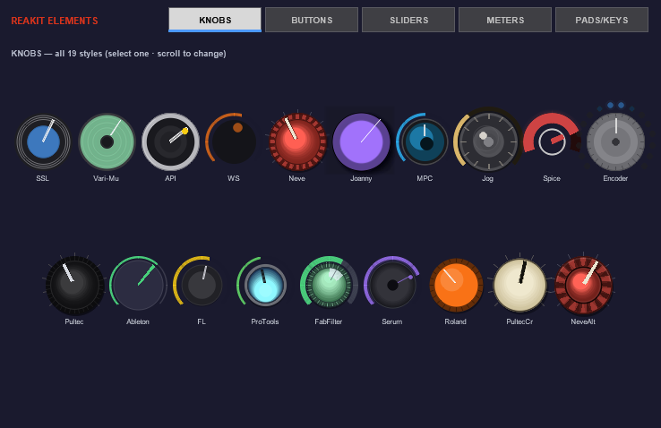
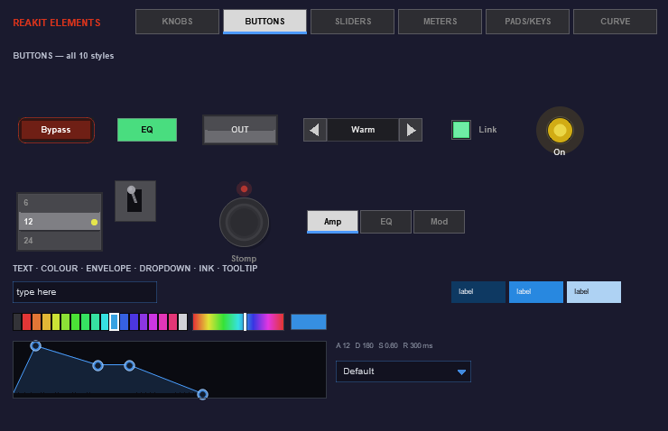
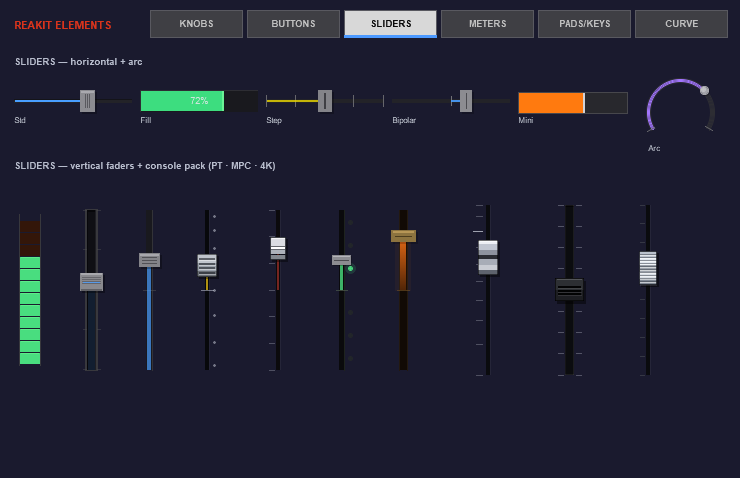
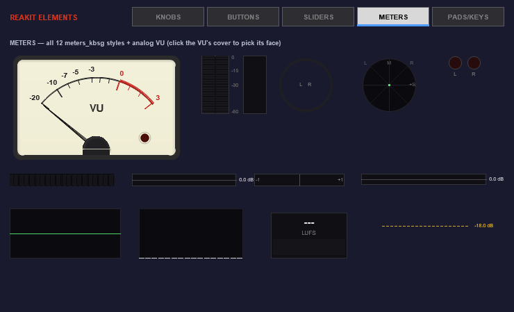
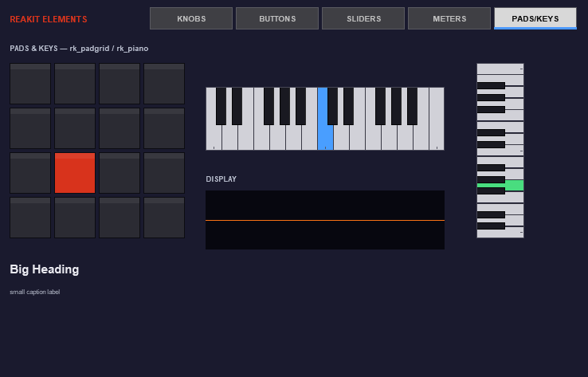

# ReaKit

A free UI / widget library for REAPER JSFX. Every knob, fader, button, meter,
VU needle, drum pad and piano key is drawn procedurally in code, so your plugin
UI is crisp at any size and re-themable with one call.

The ReaKit Elements showcase (installable below) organizes every widget into
five category tabs:



*KNOBS — all 19 styles, live on one page. Click one, scroll to change.*



*BUTTONS — all 10 styles: toggles, pills, LEDs, steppers, list select,
rocker, stomp, tab bar (the showcase's own tab bar is this widget).*



*SLIDERS — horizontal + arc up top, the vertical fader / console pack
(PT · MPC · 4K) below.*



*METERS — all 12 meters_kbsg styles plus the analog VU (click the VU's coil
cover to pick one of its 20 faces).*



*PADS & KEYS — the drum pad grid and piano keyboard widgets.*

*Everything above is drawn by the library itself.*

**19 knob styles** (SSL, Neve x2, API, Pultec x2, Ableton, Pro Tools, FabFilter,
Serum, Roland, MPC, encoders, jog wheels, ...) · **17 slider/fader types**
(incl. an SSL / Neve / Pro Tools / MPC console pack) · **10 button styles** ·
**12 meter styles with the DSP included** (peak/RMS, GR, phase, goniometer,
waveform, spectrum, LUFS) · **analog VU** (rk_vu) that meets the VU spec —
300 ms to 99%, 1.2% overshoot — with 20 faces, a GR face and a face picker · **drum pad grid** (any size, MPC pad order) · **piano keyboard**
(horizontal or vertical, any note range).

Every knob style shares one interaction model: drag, ctrl = fine, mousewheel,
double-click reset, detents, automation-safe writes.

## Install (ReaPack)

Extensions > ReaPack > Import repositories, paste:

```
https://raw.githubusercontent.com/mequaz-sudo/ReaKit/main/index.xml
```

Then install **ReaKit Elements** from the browser — it brings the library incs
with it and doubles as the element showcase, organized into category tabs
(Knobs / Buttons / Sliders / Meters / Pads & Keys — drop it on a track to see
and feel every widget).

## Use in your JSFX

The library installs to `Effects/ReaKit/Library/`. From your own plugin:

```
import ReaKit/Library/knobs_kbsg.jsfx-inc
import ReaKit/Library/sliders_kbsg.jsfx-inc
```

(or copy the incs next to your .jsfx and use plain `import knobs_kbsg.jsfx-inc`).

Minimal knob:

```
@init
freemem = 0;
KS = 16;
km = freemem; freemem += KS;

@gfx 200 120
mx = mouse_x; my = mouse_y;
LMB = mouse_cap & 1; lmb_down = LMB && !_pLMB; _pLMB = LMB;
CTRL = mouse_cap & 4; SHIFT = mouse_cap & 8;
dt = time_precise() - _lt; _lt = time_precise(); hv_speed = 11;
frame_wheel = mouse_wheel / 120; mouse_wheel = 0;

_v = rk_knob_interact(5, km, 100, 60, 30, slider1, 0, 100, 50, 0);
_v != slider1 ? ( slider1 = _v; slider_automate(slider1); );
rk_knob_draw(5, 100, 60, 30, slider1, 0, 100, 0, km[0], 0.81,0.23,0.19, 0, 0.10,0.10,0.18);
```

Knob style ids: 1 ssl · 2 varimu · 3 api · 4 ws · 5 neve · 6 jo · 7 mpc · 8 jog
· 10 sp · 11 encoder · 12 pultec · 13 ableton · 14 fl · 15 protools
· 16 fabfilter · 17 serum · 18 roland · 19 pultec_cream · 20 neve_alt.
Sliders/buttons/meters are name-dispatched — see the headers in each inc and
the showcase source for working examples of every element. The pad grid is
`rk_padgrid_interact` + `rk_padgrid_draw` (rk_padgrid.jsfx-inc) and the piano
is `rk_piano_hit` + `rk_piano_draw` (rk_piano.jsfx-inc) — both headers document
their full API in a screenful.

## Built with it

ReaKit is the UI layer of the EON Swing drum-sampler ecosystem and 20+ ReaKit
FX plugins. Discussion, screenshots and news:
https://forum.cockos.com/showthread.php?p=2952442

## License & credits

EON Studios' code is MIT — see LICENSE. A few knob and button styles derive
from other JSFX authors' work — see THIRD_PARTY_CREDITS.md (BirdBird,
Joanny/MacFizz, Spice, Witti Sound). The analog VU, the meters and everything
else are original EON Studios code.

AI tools are used in ReaKit's development; design, testing and direction by
Quaz / EON Studios.
